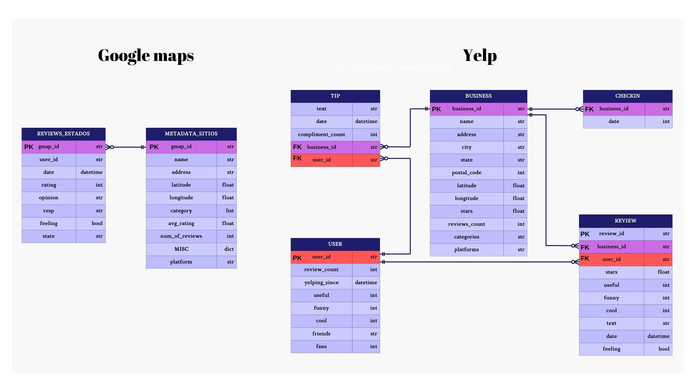
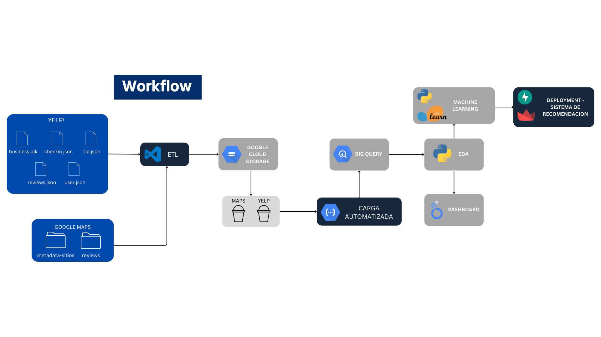
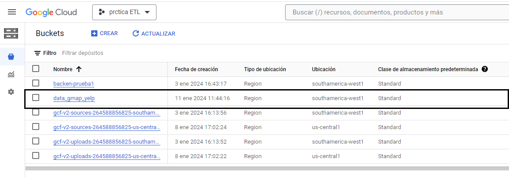
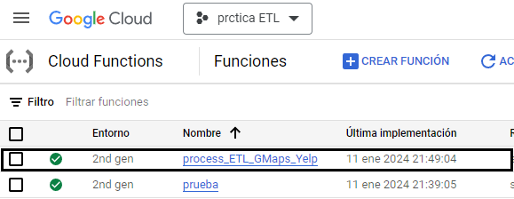

## ETL AUTOMATIZADO Y CARGA INCREMENTAL DE DATOS

La combinación de la automatización ETL y la carga incremental no solo mejora la eficiencia operativa, sino que también garantiza que la información esté siempre actualizada y disponible para la toma de decisiones en tiempo real.

## Diagrama ER
Un diagrama ER (Entidad-Relacion) es una representación visual que describe las relaciones entre diferentes entidades en un sistema de información o base de datos. Este tipo de diagrama es fundamental para modelar la estructura de una base de datos y comprender cómo las distintas entidades interactúan entre sí.

    

## Procesamiento de datos
Mostraremos el esquema del tratamiento de los datos:

    

  

## Data Lake
La parte inicial de este proyecto es cargar los datos sin procesar que se nos proporcionaron y almacenarlos en nuestro Data Lake.

Un Data Lake es un entorno de almacenamiento de datos que facilita la retención de grandes volúmenes de información en su formato original, sin requerir una estructuración previa. Este enfoque permite un acceso más ágil y flexible a los datos. En este contexto, optaremos por Google Cloud Storage para almacenar los datos sin procesar provenientes de fuentes como Google y Yelp.

    

## Transformación de datos - Cloud Functions

El servicio Google Cloud Functions por medio de funciones se encargará de extraer los datos del Data Lake, transformarlos/limpiarlos y cargarlos en nuestro Data Warehouse.

Utilizamos Cloud Functions para automatizar el proceso de ETL (Extract, Transform, Load). Las funciones almacenadas en Cloud Functions están asociadas a un disparador, el cual detecta la carga de nuevos archivos en nuestro Data Lake, encargándose de limpiar y transformar los datos sin procesar. Posteriormente, los datos procesados se almacenan en nuestro Data Warehouse.

Este enfoque automatiza no solo la transformación inicial sino también la adición de nuevos datos. Una de las funciones específicas se encarga de limpiar y transformar estos nuevos datos externos, ejecutando además una consulta en Google BigQuery para actualizar la información actual en el almacén de datos.

    

## Data Warehouse

Google BigQuery es un servicio de Data Warehouse de Google que vamos a utilizar para almacenar y estructurar nuestros datos procesados. El Data Warehouse podrá actualizarse con los nuevos datos que ingresen mediante la automatización. 

    

## Tecnologías

- Google Cloud Storage
- Google Cloud Function
- Big Query
- Python
- Pandas

  

A continuación, mostramos el funcionamiento de la carga incremental:

    <video height="500" controls>
    <source src='img/VID-20240111-WA0055.mp4' type="video/mp4">
    
