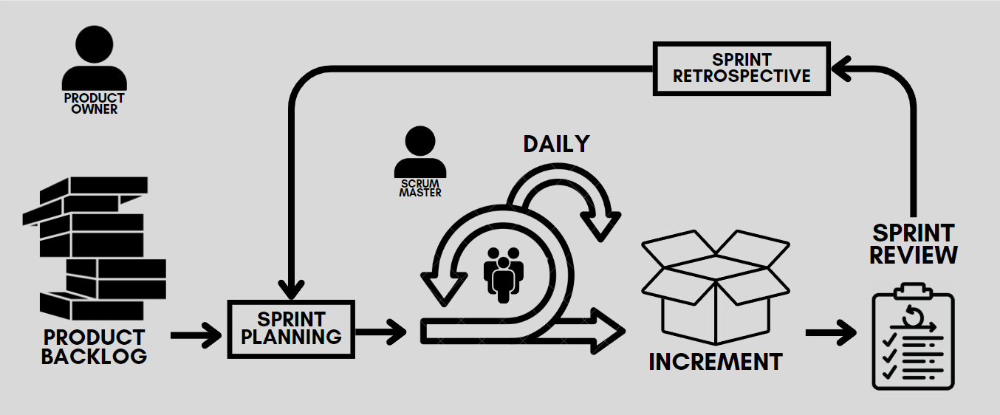

<h1 align='center'>
 
<b>PROYECTO GRUPAL - Google Maps & Yelp</b>

 </h1>

<h2>Índice</h2>

- [Introducción](#introducción)
- [¿Quiénes somos?](#¿quienes-somos)
- [¿Qué ofrecemos?](#¿qué-ofrecemos)
- [Alcance de nuestra data](#alcance-de-nuestra-data)
- [Stack tecnológico](#stack-tecnológico)
- [Nuestro equipo](#nuestro-equipo)
- [Metodología de trabajo](#metodología-de-trabajo)
- [KPIs](#kpis)

## Introducción

En la actualidad, la retroalimentación de los usuarios se ha convertido en un recurso invaluable para las empresas, proporcionando una ventana directa a las experiencias de los consumidores. Plataformas de reseñas como Yelp y Google Maps capturan de manera constante las opiniones que abarcan desde restaurantes hasta servicios turísticos. La capacidad de analizar y comprender estas opiniones no solo se ha vuelto esencial, sino también estratégica para el desarrollo empresarial.

En este proyecto, buscamos no solo comprender las opiniones de los usuarios, sino también transformar esa comprensión en información base para la toma de decisiones estratégicas que impulsen el éxito y el crecimiento sostenible de nuestros clientes en el mercado estadounidense.

## ¿Quienes somos?

En Merydian Datalytics, nos dedicamos a comprender los secretos que residen en los datos, brindando a nuestros clientes las herramientas necesarias para tomar decisiones estratégicas. Con un equipo experimentado y comprometido, estamos enfocados en proporcionar soluciones analíticas para satisfacer las necesidades específicas de nuestros clientes.

## ¿Qué ofrecemos?

- Sistema de Recomendación para los Usuarios:
Utilizamos técnicas avanzadas de análisis de sentimientos para examinar detalladamente las opiniones de usuarios en plataformas clave como Yelp y Google Maps, proporcionando un sistema de recomendación para los usuarios a partir de la información recaudada. 

- Pronóstico de Tendencias de Mercado:
Aplicamos análisis predictivos para identificar los rubros de negocios dentro del sector de restaurantes y turismo que experimentarán crecimiento o declive, permitiendo a nuestros clientes anticiparse a las tendencias del mercado.

## Alcance de nuestra data

Con el objetivo de diversificar los datos en función a los Estados, seleccionamos los mismos siguiendo el criterio de los tres Estados que posean mayor PBI per cápita y los tres Estados que posean menor PBI per cápita, verificando disponer de datos suficientes sobre los mismos en ambas fuentes.

Teniendo en cuenta que en los últimos años, cambió el uso de las redes sociales y la tendencia de consumo post pandemia, decidimos acotar nuestros datos entre los años 2018 y 2021 inclusive.

## Stack Tecnológico

Para la arquitectura del proyecto, hemos optado por un stack tecnológico que incluye Google Cloud Platform como base. Utilizaremos BigQuery como nuestro Data Warehouse y Google Storage como Data Lake para manejar eficientemente grandes volúmenes de datos. Además, hemos seleccionado Jira gestión de tareas y Looker Studio para visualizar y analizar datos de manera efectiva. 

En el ámbito de los sistemas de recomendación, confiamos en el poder de FastAPI. Para presentaciones visuales, Canva será nuestra herramienta principal. 

Todo esto será ejecutado con el soporte del lenguaje Python, aprovechando las capacidades de Visual Studio Code y Google Colab para la limpieza y transformación de datos iniciales, empleando librerías como seaborn, pandas y matplotlib, proporcionándonos una visión sólida del abordaje para futuras tareas a desarrollar. Y por último utilizaremos GitHub para nuestro repositorio, ya que ofrece un conjunto integral de herramientas que facilitan la colaboración, el control de versiones y la gestión eficiente del desarrollo del proyecto.

&nbsp;&nbsp;&nbsp;&nbsp;&nbsp;&nbsp;&nbsp;&nbsp;&nbsp;&nbsp;&nbsp;&nbsp;&nbsp;&nbsp;&nbsp;&nbsp;&nbsp;&nbsp;&nbsp;&nbsp;&nbsp;&nbsp;&nbsp;&nbsp;

## Nuestro equipo

- Mauro Pereyro (Data Scientist)
- Maximiliano Pizzio (Data Analyst) 
- Rebeca Vildósola (Data Analyst)
- Soledad Espíritu (Data Engineer)
- Emanuel Duenk (Data Scientist)
- Sebastián Althabe (Data Engineer)

## Metodología de trabajo

Se propuso la siguiente planificación de trabajo, utilizando el Diagrama de Gantt:

  

También utilizamos la metodología SCRUM con dos Dailies, más de dos reuniones de equipo y una DEMO por semana:

  

- Notas reunión: https://docs.google.com/document/d/138njT8nhIx37JW_BM0aoCryc7mcYEBctzZ_uwstjLEU/edit?usp=sharing
- Link Jira: https://pf-grupo04.atlassian.net/

## KPIs

- <b>1- Valoración promedio de los negocios:</b>

Se propone analizar de manera mensual las clasificaciones de los negocios, basándonos en las reseñas recibidas.

Fórmula de uso: ((Calificaciones mes actual - Calificaciones mes anterior) / Calificaciones mes anterior)

Este KPI nos permite encontrar aquellos negocios con valoraciones altas (4-5 estrellas), que indiquen una buena calidad y servicio.

- <b>2- Tasa de respuesta del negocio:</b>

 Se propone analizar de manera mensual el porcentaje de reseñas que el negocio respondió en comparación con el total de reseñas recibidas.

Fórmula de uso: (Reseñas respondidas / Total de reseñas) * 100

El objetivo de este KPI es para alcanzar y garantizar una tasa de respuesta al usuario de mínimo el 80%

- <b>3- Índice de interacción y nivel de engagement de las reseñas:</b>

Se propone analizar de manera trimestral el nivel de interacción y participación de los usuarios con las reseñas, considerando los votos "useful", "funny" y "cool".

Fórmula de uso: (Suma de votos "useful", "funny", "cool") / Número total de reseñas.

El objetivo de este KPI es para incrementar el nivel de engagement del usuario en un 5%.

- <b>4- Indicador de crecimiento de Check-in:</b>

Se propone analizar de manera mensual el incremento en la cantidad de check-in.

Fórmula de uso: ((Cantidad de check-in periodo actual - Cantidad de check-in periodo anterior) / Cantidad de check-in periodo anterior) * 100.

El objetivo de este KPI es incrementar la cantidad de check-in en un 5%. 

- <b>5- Índice de calidad de restaurantes en áreas desabastecidas</b>

Se propone evaluar de manera mensual la concentración de restaurantes según su calidad en áreas geográficas desabastecidas.

Fórmula de uso: (Cantidad restaurantes con calificación alta en área desabastecida / Total restaurantes en área desabastecida) * 100

El objetivo de este KPI es identificar la proporción de restaurantes de alta calidad en áreas desabastecidas e incrementarlo un 1%.